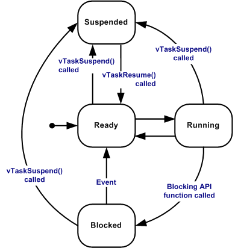

# Introduction aux Systèmes Temps Réels

*Ir Paul S. Kabidu, M.Eng. <spaulkabidu@gmail.com>*
{: style="text-align: center;" }

---

[Acceuil](../#Acceuil)
  
<br>
<br>


### **Les Systèmes Embarquées et Systèmes Digitaux**
  
Un **système embarqué** est un système numérique basé sur un processeur, généralement un microcontrôleur SoC (System On Chip). Il est conçu pour répondre à une **tâche spécifique et bien définie**. Il n'est ni généraliste ni polyvalent, contrairement à un PC qui doit savoir tout faire (bureautique, jeux, navigation web) ou à un smartphone qui exécute des applications diverses simultanément (banque, jeux, réseaux sociaux, outils de travail). 

La différence fondamentale entre les systèmes à base de microcontrôleurs et les ordinateurs de type PC réside dans leur **spécialisation** et leur **tâche dédiée**.
Un système embarqué peut toutefois reposer sur un **microprocesseur** plus puissant. Par exemple, le calculateur de conduite autonome (NVIDIA Drive) utilise la puissance d'un supercalculateur graphique (GPU) pour analyser en temps réel les flux de huit caméras, des radars et des lidars, et prendre des décisions de conduite. Dans ce cas, il n'exécute qu'une seule application, mais extrêmement exigeante.

Un système embarqué combine **matériel (hardware) et logiciel (software)** pour fonctionner. Il est optimisé pour une tâche unique et souvent critique, avec des contraintes de temps réel et de fiabilité. Ses principales caractéristiques sont :

- **Mémoire limitée** : on retrouve quelques kilo-octets comparés aux giga-octets des PC. C'est pour cette raison que le code doit donc être compact et efficace, le langages C/C++ est grandement privilégiés.

- **Consommation énergétique maîtrisée** : la plupart de ces systèmes sont autonomes en énergie, ils fonctionnent sur des batterie ou des piles.

- **Contraintes temporelles** : c'est-à-dire le délai de réponse est souvent critique (systèmes temps réel).

- **Fiabilité et robustesse** : ils doivent fonctionner sans intervention humaine pendant des années, parfois dans des environnements hostiles et délivrer toujours des bons resultats.

- **Interaction minimale** : l'interface avec le monde extérieur est réduite à l'essentiel pour sa fonction dédiée, soit un simple bouton poussoir est suffisant.
  
---

<br>


### **Les Systèmes Temps Réels**

Un système est dit **Temps Reel** lorsque les  résultats demeurent toujours pertitantes et valides après leurs délivrance. Il ne suffit pas de produire un résultat correct ; encore faut-il le fournir dans le délai requis, faute de quoi les conséquences peuvent être graves. 

La validité des résultats ne dépend pas seulement de la logique correcte du calcul, mais aussi du moment où ces résultats sont produits. Prenons l'exemple du déclenchement d'un airbag lors d'un choc d'un vehicule : si le signal arrive ne serait-ce que 50 millisecondes après l'impact, le système est inutile et les conséquences pour le conducteur peuvent être graves. D'une autre facon on peut dire **si les résultats du systèmes produits sont corrects mais arrivent en retard, ce que le système a échoué, c'est équivalent à une défaillance**.

C'est pourquoi on joue sur le **determinisme**, la capacité à garantir un comportement **previsible** dans le temps, le temps est vraiement critique. Un système temps réel privilégie la déterminisme garantir qu'une tâche se terminera toujours en moins de X microsecondes maximale non negociable. 

Pour gérer ces contraintes, deux approches sont possibles sur un processeur : 

- Utiliser le mécanisme des **interruptions matérielles**, géré directement par le CPU.
- Employer un **ordonnanceur** (scheduler) fourni par un système d'exploitation temps réel (RTOS) lorsqu'il faut coordonner plusieurs tâches avec des échéances prévisibles.


#### **Les trois types de systèmes temps réel**

On distingue classiquement trois catégories :

- **Systèmes temps réel stricts (Hard Real-Time)**
Dans cette catégorie, le non-respect du délais entraîne une catastophe ou une **défaillance totale** du système. 
Exemple : comme précédement cité, le déclenchement d'un airbag ou le système de freinage d'un train, commande de vol d'un avion. Si le signal arrive avec centaines de millisecondes de retard, le système est inutile et les conséquences peuvent être fatales.

Les systèmes de traitement numérique du signal (DSP) sont généralement des systèmes temps réel stricts. Prenons l'exemple d'un signal analogique échantillonné à 8 kHz (pour préserver des fréquences jusqu'à 4 kHz). La période d'échantillonnage est de 125 µs. Cela signifie que le système dispose de 125 µs pour effectuer tout le traitement nécessaire avant l'arrivée de l'échantillon suivant. Si le système ne peut pas suivre ce rythme, il échoue. C'est une caractéristique typique d'un système temps réel strict.

- **Systèmes temps réel mous (Soft Real-Time)**
Pour ce type de système, léger retard est tolérable sans conséquences graves, même si l'on cherche toujours à respecter les délais. 
Exemple : Un distributeur automatique de billets (ATM). Si l'affichage met deux secondes de plus, l'utilisateur attend, mais le service est finalement rendu.

- **Systèmes temps réel fermes (Firm Real-Time)**
Ici le non-respect du délais rend le résultat inutile, cependant cela ne détruit pas le système et ne provoque pas de défaillance catastrophique. 
Exemple : Un flux vidéo en direct, un système de contrôle qualité sur une ligne de production. Si une image est traitée trop tard, on l'ignore et on passe à la suivante, mais la qualité globale diminue. ceci affecte directement la qualité du service du système.
  
---
<br>


### **Les Systèmes d'Exploitation Temps Réels (RTOS)**

Un **système d'exploitation temps réel** (RTOS, *Real-Time Operating System*) est un logiciel conçu spécifiquement pour gérer des applications qui exigent un comportement **déterministe** et une précision temporelle absolue. Il doit garantir que les tâches critiques sont exécutées exactement au moment voulu. Sa priorité est le respect des échéances ou délais, contrairement aux systèmes d'exploitation généralistes (Windows, Linux, Android) qui sont avant tout optimisés pour l'expérience utilisateur et le partage équitable des ressources. Exemples de RTOS couramment utilisés dans l'embarqué : FreeRTOS, Zephyr, VxWorks, QNX,...

Lorsque le nombre de tâches est limité, on peut les gérer directement avec les interruptions matérielles du microcontrôleur. Dès que la complexité augmente et que la précision temporelle devient critique, l'utilisation d'un RTOS s'impose. Il permet d'exécuter plusieurs tâches sur un même processeur en donnant l'illusion du **parallélisme**, et organise le partage des ressources (temps CPU, mémoire, périphériques) selon des règles prédéfinies.  

Par exemple, un appareil doit faire clignoter une LED tout en surveillant un bouton. Une approche simple consisterait à tout mettre dans une boucle, mais elle devient vite insuffisante. On utilise alors une approche **multitâche** : plusieurs tâches (ou programmes) se partagent le processeur, donnant l'illusion d'un parallélisme.


#### **Le Noyau multitâche**

Le **cœur du système**, ou _kernel_, est le module responsable du partage du processeur entre les différentes tâches. Il est très léger (quelques kilo-octets), ce qui le rend adapté aux microcontrôleurs aux ressources limitées.

Sans noyau, on pourrait exécuter plusieurs tâches dans une boucle, mais les performances temps réel deviennent difficiles à maîtriser. On peut aussi coder les tâches sous forme d'interruptions, mais le code devient vite inextricable. Un noyau multitâche apporte des avantages décisifs :

| Avantage | Description |
|----------|-------------|
| **Maîtrise temporelle** | L'ordonnancement garantit le respect des échéances. |
| **Modularité** | On peut ajouter ou supprimer des tâches sans tout remanier. |
| **Test et débogage** | Les tâches isolées sont plus faciles à valider. |
| **Communication inter‑tâches** | Files, sémaphores, etc., sont fournis par le noyau. |
| **Synchronisation** | Accès contrôlé aux ressources partagées. |
| **Gestion du CPU** | Le noyau alloue le temps processeur selon des règles claires. |
| **Protection mémoire** | Les tâches ne peuvent pas empiéter les unes sur les autres. |
| **Priorités** | Les tâches importantes peuvent préempter les autres. |

Le cœur d'un RTOS, **noyau (kernel)** est responsable des fonctions de base : création de tâches, ordonnancement, gestion des files et sémaphores, etc. Les RTOS plus élaborés offrent aussi des services de gestion de fichiers, de réseau, etc.


#### **Qu'est ce qu'une tache?**

Une **tâche (task)** est une unité logicielle indépendante possédant son propre contexte (état du processeur, registres, pile). L'ordonnanceur passe d'une tâche à l'autre par une **commutation de contexte** : le contexte de la tâche en cours est sauvegardé, celui de la prochaine tâche est restauré. Le temps nécessaire à cette opération est généralement négligeable.. Chaque tâche peut se trouver dans l'un des trois états suivants :

- **Running (en cours)** : la tâche utilise actuellement le processeur.
- **Ready (prête)** : la tâche veut s'exécuter, mais une tâche de priorité supérieure occupe le processeur.
- **Blocked (bloquée)** : la tâche attend un événement (par exemple, un signal provenant d'un capteur ou l'expiration d'un délai de 10 ms).

{ width=300, align=center }

Au‑delà des états de base (running, ready, blocked), on trouve souvent :

- **Suspendu (suspend)** : la tâche est volontairement mise en sommeil (soi‑même ou par une autre) et ne sera pas ordonnancée tant qu’elle n’est pas reprise.
- **Endormi (sleep)** : suspension temporaire pour une durée définie, gérée par le tick.
- **Bloqué (blocked)** : la tâche attend une ressource (sémaphore, file, etc.). Peut inclure un timeout.
- **Terminé / fini (finished)** : la fonction principale s’est terminée. Nécessite une réinitialisation pour être réexécutée.
- **Supprimé (deleted)** : après destruction dynamique.


#### **Commutation de contexte (Context Switch)**

Lorsqu'une préemption a lieu, le RTOS sauvegarde l'état des registres du processeur pour la tâche interrompue. Cette opération, appelée **commutation de contexte**, permet de reprendre ultérieurement l'exécution de la tâche exactement là où elle s'était arrêtée, comme si rien ne s'était passé.

Ce qui constitue le contexte d’une tâche est l’ensemble des registres du processeur, la pile (stack) locale à la tâche (contenant les variables automatiques, adresses de retour, etc.). Et éventuellement d’autres données propres à la tâche.


#### **L'ordonnanceur (scheduler)**

L'**ordonnanceur** est la partie la plus critique du RTOS. Il gère les priorités entre les tâches, chaque tâche se voyant attribuer un niveau de priorité par le développeur. L'ordonnanceur garantit que la tâche de plus haute priorité prête à être exécutée occupe toujours le processeur. Si une tâche de priorité 1 est en cours de calcul et qu'une tâche de priorité 10 (par exemple une urgence) devient prête, l'ordonnanceur **suspend immédiatement** la première tâche. C'est le principe de la **préemption**.

Exemple : on peut assigner une priorité élevée (10) à une routine d'arrêt d'urgence, et une priorité basse (1) à une tâche d'affichage.


**Algorithmes d'ordonnancement**

Trois familles d'algorithmes sont couramment utilisées ; leurs variantes ou combinaisons couvrent la plupart des besoins

1. **Ordonnancement coopératif (non préemptif)**

Les tâches cèdent volontairement le processeur lorsqu'elles n'ont rien à faire ou attendent une ressource. Cet algorithme est simple mais dangereux : une tâche peut monopoliser le CPU et bloquer les autres. Il n'est utilisable que dans des systèmes sans contraintes temps réel strictes.

Une implémentation rudimentaire consiste en une boucle infinie qui appelle les fonctions des tâches les unes après les autres :

```c
while (1) {
    tache1();
    tache2();
    tache3();
}
```

Cependant, cela ne permet pas de reprendre une tâche là où elle s'était arrêtée – la notion de contexte n'est pas gérée. Pour cela, on peut utiliser des machines d'états ou des interruptions timer.

2. **Ordonnancement circulaire (Round‑Robin)**

Chaque tâche reçoit un quantum de temps identique. Quand le quantum expire, la tâche est placée en fin de file et la suivante est activée.

```
Tâche A → Tâche B → Tâche C → (retour à A)
```

Avantages : équitable, temps de réponse moyen prévisible.
Inconvénients : inadapté aux tâches de priorité différente, pas de garantie temps réel.

3 . **Ordonnancement préemptif**

L'**Ordonnancement préemptif** (*Preemptive Scheduling*) est la capacité du système à interrompre une tâche en cours d'exécution pour en démarrer une autre de priorité supérieure. C'est l'algorithme roi des systèmes temps réel.

Chaque tâche possède une priorité. À tout moment, la tâche prête de plus haute priorité s'exécute. Si une tâche de priorité supérieure devient prête, elle interrompt immédiatement la tâche en cours (préemption).

```
Tâche haute priorité (priorité 3) : s'exécute
Tâche basse priorité (priorité 1) : s'exécute quand la haute est bloquée
```

Les priorités peuvent être **statiques** (fixées à la conception) ou **dynamiques** (pouvant évoluer). Dans un noyau comme FreeRTOS, les priorités sont fixes et les tâches de même priorité s'exécutent en round‑robin.

Avantage : permet de garantir le respect des échéances.
Inconvénient : une tâche très prioritaire peut affamer les autres si elle ne se bloque jamais.

Deux algorithmes théoriques majeurs se dégagent : le Rate-Monotonic Scheduling (RMS) et l'Earliest-Deadline-First (EDF).

- **Rate-Monotonic Scheduling (RMS)** : l'ordonnancement monotonique par taux est un algorithme à priorités statiques. Les tâches sont **périodiques** et leur échéance (deadline) est exactement égale à leur période. Les priorités sont **statiques**, plus la période d'une tâche est courte, plus sa priorité est élevée. Dans l'ordonnancement est préemptif la tâche de plus haute priorité s'exécute toujours.

- **Earliest-Deadline-First (EDF)** : l'ordonnancement par échéance la plus proche (EDF) est un algorithme à **priorités dynamiques**. Les tâches (périodiques ou non) sont triées par ordre d'échéance croissant, celle dont l'échéance est la plus proche a la plus haute priorité. La priorité d'une tâche change à chaque instant en fonction de l'urgence de son échéance.

- **Deadline-Monotonic Scheduling (DMS)** : le Deadline-Monotonic Scheduling est une généralisation de RMS pour les cas où l'échéance peut être inférieure ou égale à la période. Les tâches avec les échéances les plus courtes reçoivent les priorités les plus élevées.

**Choisir un algorithme ?**

Pour un système temps réel, l'ordonnancement préemptif à priorités fixes est généralement le meilleur choix :

- Les tâches critiques ont une priorité élevée.
- Si plusieurs tâches critiques ont la même priorité, elles se partagent le temps (round‑robin).
- Les tâches non critiques s'exécutent en arrière‑plan.

Pour des applications sans contrainte temporelle, un simple ordonnancement coopératif peut suffire.

---
<br>

#### **Le Tick système**

Le RTOS utilise un timer matériel interne au microcontrôleur (sur les processeurs Cortex-M, on emploie généralement le timer **SysTick**) qui génère une interruption à intervalles réguliers (par exemple toutes les 1 ms). À chaque interruption (le tick), le RTOS reprend la main pour vérifier si une tâche de plus haute priorité doit être exécutée. Ce mécanisme sert également à gérer les temporisations demandées par les tâches.

C'est grâce à cette latence d'interruption minimale et à ce comportement déterministe que l'on qualifie un tel système d'**exploitation temps réel**. Dans un RTOS, le temps maximal nécessaire pour passer d'une tâche à une autre est constant et connu à l'avance. Par exemple, le temps de réaction à l'appui sur un bouton d'urgence sera prévisible à la microseconde près, alors que sous un OS généraliste comme Windows, ce temps peut varier considérablement en fonction de la charge du processeur.

**Pour une comparaison imagée** :

- **OS Classique (PC)** est comme un **buffet à volonté**. Tout le monde essaie de se servir, on peut attendre un peu, mais tout le monde finit par manger.

- **RTOS** est comme un service d'**urgence d'hôpital**. Si une ambulance arrive (haute priorité), tout le reste s'arrête immédiatement pour lui laisser le passage.

#### **Les mécanismes de synchronisation (Sécurité)**

Les tâches doivent souvent communiquer ou collaborer sans risquer de corrompre des données partagées. Le RTOS fournit pour cela des outils sécurisés :

- **Sémaphores et Mutex** : ils évitent que deux tâches n'accèdent simultanément à une ressource critique (par exemple le bus de communication vers les moteurs). Chaque tâche doit posséder un « jeton » pour utiliser la ressource ; si une autre tâche tente de l'obtenir, elle est bloquée jusqu'à ce que le jeton soit libéré.

- **Files d'attente (Queues)** : elles permettent d'échanger des messages entre tâches sans risque de collision. Une tâche peut envoyer des données dans une file, et une autre tâche les récupère de manière ordonnée et sécurisée. 

Exemple typique : une tâche d'acquisition ADC lit des capteurs à haute fréquence et place les échantillons dans une file ; une autre tâche, moins prioritaire, vide cette file pour afficher les valeurs sur le moniteur série. Cela découple la production rapide des données de leur consommation plus lente, sans perte d'information ni blocage.

---
<br>
  

### Liens connexes

- [Présentation architecturale du Microcontrôleur STM32F4](../stm32f4/mcu_intro/index.md)
- [Introduction pratique à FreeRTOS](../rtos/freertos.md)
- [Création Projet sous Keil uVision](../ressources/demarrerKiel.md)
- [Configuration FreeRTOS sous Kiel pour STM32F4](../ressources/configRtosKiel.md)