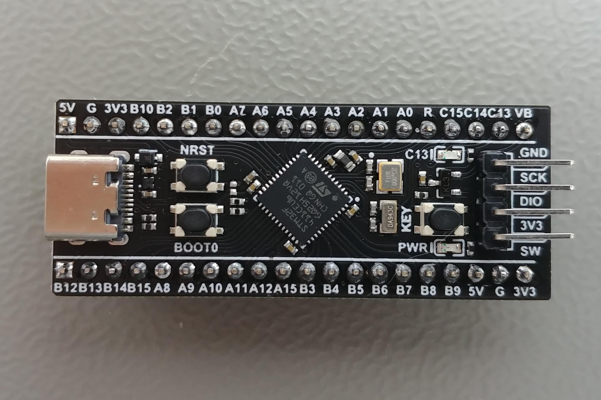

# Interfaces d'Entrée/Sortie GPIO et Interruptions

*Ir Paul S. Kabidu, M.Eng. <spaulkabidu@gmail.com>*
{: style="text-align: center;" }

---

[Accueil](../../#Accueil)
  
<br>
<br>


### **GPIO**

Les **GPIO** (_General Purpose Input-Output_) sont des périphériques d'entrée-sortie numériques. Ils sont utilisées pour interfacer avec des LED, des interrupteurs, des afficheurs LCD, des claviers, etc. Le STM32F4 dispose de plusieurs ports nommés (GPIOA, GPIOB, GPIOC, …, GPIOH). Chaque port possède ses propres registres de configuration sur 32 bits.

**Registres principaux de configuration d'un port :**

Chaque port GPIO est contrôlé par plusieurs registres 32 bits. L'adresse de base d'un port est donnée par des constantes comme `GPIOA_BASE (0x40020000)`. En CMSIS, on accède à ces registres via une structure `GPIO_TypeDef`.

```c
typedef struct {
    volatile uint32_t MODER;    // Mode register (offset 0x00)
    volatile uint32_t OTYPER;   // Output type register (0x04)
    volatile uint32_t OSPEEDR;  // Output speed register (0x08)
    volatile uint32_t PUPDR;    // Pull-up/pull-down register (0x0C)
    volatile uint32_t IDR;      // Input data register (0x10)
    volatile uint32_t ODR;      // Output data register (0x14)
    volatile uint32_t BSRR;     // Bit set/reset register (0x18)
    volatile uint32_t LCKR;     // Lock register (0x1C)
    volatile uint32_t AFR[2];   // Alternate function registers (0x20-0x24)
} GPIO_TypeDef;
```

|Registre	|Nom	|Description|
|-----------|-------|-----------|
|`MODER`	|Mode Register	|Configure la direction de chaque broche (00: Entrée, 01: Sortie, 10: Fonction alternative, 11: Analogique).|
|`IDR`	|Input Data Register	|Permet de lire l'état logique présent sur les broches configurées en entrée.|
|`ODR`	|Output |Data Register	|Permet d’écrire (ou de lire) l’état des broches configurées en sortie. Attention : une opération comme `ODR |= (1<<13)` n’est pas atomique (lecture-modification-écriture) et peut être interrompue.|
|`BSRR`	|Bit Set/Reset Register	|Permet de modifier l’état de manière **atomique** en une seule écriture. On peut positionner un bit à 1 (Set) ou à 0 (Reset) sans affecter les autres bits. C’est plus sûr en environnement multitâche ou avec interruptions.|
|`AFR`| Alternative Function Register| Sélection de la fonction alternative (AF0 à AF15).|
|`PUPDR`|Pull-up/pull-down register|Pour activer le pull‑up sur PA0 (bouton)|

---
<br>


### **Configuration d'une Sortie (LED sur PC13)**

Pour faire clignoter une LED, nous devons suivre trois étapes logiques dans les registres :

- Activer l’horloge du port (`RCC`) : Sans horloge, le périphérique est inactif. Avant d'utiliser un GPIO, il faut activer son horloge via le registre `RCC_AHB1ENR`.
- Configurer la broche en sortie via le registre `MODER`.
- Piloter l’état en écrivant dans `BSRR` ou `ODR`.

Exemple Pratique : Faire clignoter la LED (PC13)
La carte Black Pill intègre une LED connectée à PC13 (active à l'état bas).

```c
#include "stm32f4xx.h"

// Code Sans RTOS
int main(void) {
    // 1. Activer l'horloge du Port C (Bit 2 à 1)
    RCC->AHB1ENR |= RCC_AHB1ENR_GPIOCEN;       // 1. Horloge ON
    // 2. Configurer PC13 en sortie (Bits 26-27 à 01)
    GPIOC->MODER |= (1 << (13 * 2));            // 2. PC13 en Sortie

    while(1) {
        GPIOC->BSRR = (1 << (13 + 16));         // LED ON (Reset bit 13) → LED allumée (active bas)
        for(int i=0; i<500000; i++);            // Attente logicielle (Bloque le CPU)
        GPIOC->BSRR = (1 << 13);                // LED OFF (Set bit 13)
        for(int i=0; i<500000; i++);
    }
    return 0;
}
```

Usage du registre ODR :
```c
#include "stm32f4xx.h"

// Code Bare Metal pur (Sans RTOS)
int main(void) {
    // 1. Activer l'horloge du Port C (Bit 2 à 1)
    RCC->AHB1ENR |= RCC_AHB1ENR_GPIOCEN;       // 1. Horloge ON
    // 2. PC13 en sortie (Bits 26-27 à 01)
    GPIOC->MODER |= (1 << (13 * 2));            // 2. PC13 en Sortie

    while(1) {
        GPIOC->ODR ^= (1 << 13); // Inverser l'état
        for(int i=0; i<1000000; i++); // ATTENTE INUTILE : Le CPU "compte ses doigts"
    }
    return 0;
}
```

Explications :

- L'horloge du port C est activée via `RCC_AHB1ENR`. Sans cela, le port ne répond pas. 
- Le mode de la broche est configuré en sortie (MODER = 01).
- On utilise BSRR pour modifier l'état de manière atomique : écrire dans les bits 0‑15 met la broche correspondante à 1, écrire dans les bits 16‑31 la remet à 0.
- ODR est utilisé pour le toggle (lecture‑modification‑écriture, non atomique).

- Les périphériques GPIO sont alimentés par une horloge. Pour économiser l'énergie, cette horloge est désactivée par défaut après un reset. Il faut l'activer via le registre `RCC_AHB1ENR` (Reset and Clock Control – AHB1 Enable Register). Chaque port possède un bit d'activation.

```c
RCC->AHB1ENR |= RCC_AHB1ENR_GPIOAEN;   // active GPIOA
RCC->AHB1ENR |= RCC_AHB1ENR_GPIOCEN;   // active GPIOC
```

Les constantes RCC_AHB1ENR_GPIOxEN sont définies dans le fichier d'en‑tête `stm32f4xx.h`.

**Problème des boucles `for` :**

Pendant ces attentes, le processeur est totalement occupé à décrémenter un compteur. Si un événement externe survient (appui sur un bouton), il ne pourra pas y réagir avant la fin de la boucle. C'est pourquoi, dans un système temps réel, on préfère des mécanismes non bloquants comme les interruptions ou les délais gérés par un RTOS (par exemple vTaskDelay() sous FreeRTOS).

---
<br>


### **Gestion des Entrées/Sorties dans une Tâche FreeRTOS**

Dans une approche bare metal classique, on utilise des boucles d'attente active (`for(i=0; i<delay; i++);`) pour créer des temporisations `delay()`. Ces boucles monopolisent le processeur, l'empêchant de réagir à d'autres événements pendant toute leur durée.

Avec FreeRTOS, la philosophie change : quand une tâche n'a rien d'utile à faire (par exemple en attendant qu'une LED clignote), elle doit rendre la main pour qu'une autre tâche puisse s'exécuter. C'est le rôle de `vTaskDelay()`.

La fonction `vTaskDelay()` place la tâche courante dans l'état Blocked pendant une durée donnée. Pendant ce temps, le processeur peut exécuter d'autres tâches prêtes. À l'expiration du délai, la tâche repasse dans l'état Ready et sera automatiquement reprise par l'ordonnanceur.

```c
// Tâche LED ---
void vTaskBlink(void *pvParameters) {
    (void) pvParameters;
    while(1) {
        // LED ON (active bas)
        GPIOC->BSRR = (1 << (13 + 16));
        vTaskDelay(pdMS_TO_TICKS(50));   // Délai non‑bloquant de 500 ms

        // LED OFF
        GPIOC->BSRR = (1 << 13);
        vTaskDelay(pdMS_TO_TICKS(50));   // Délai non‑bloquant de 500 ms
    }
}
```

- La macro `pdMS_TO_TICKS(500)` convertit une durée en millisecondes en nombre de ticks système (dépend de `configTICK_RATE_HZ`). 
- Pendant `pdMS_TO_TICKS(500)`, la tâche `vTaskBlink` dort et elle ne consomme 0% du CPU. L'ordonnanceur peut alors exécuter d'autres tâches de priorité inférieure ou égale.


Code complet qui clignote la LED sur la carte blackpill PC13 :

```c
#include "stm32f4xx.h"
#include "FreeRTOS.h"
#include "task.h"

// Initialisation GPIO pour LED PC13 
void LED_Init(void) {
    RCC->AHB1ENR |= RCC_AHB1ENR_GPIOCEN;        // Activer horloge GPIOC
    GPIOC->MODER &= ~(3 << (13 * 2));           // Clear mode PC13
    GPIOC->MODER |=  (1 << (13 * 2));           // PC13 en sortie
}

// Tâche Blink
void vTaskBlink(void *pvParameters) {
    (void) pvParameters;
    while(1) {
        // LED ON (active bas)
        GPIOC->BSRR = (1 << (13 + 16));
        vTaskDelay(pdMS_TO_TICKS(500));   // délai 500 ms

        // LED OFF
        GPIOC->BSRR = (1 << 13);
        vTaskDelay(pdMS_TO_TICKS(500));   // délai 500 ms
    }
}

int main(void) {
    LED_Init();

    // Créer la tâche LED
    xTaskCreate(vTaskBlink, "LED", 128, NULL, 1, NULL);

    // Lancer le scheduler FreeRTOS
    vTaskStartScheduler();

    // Ne devrait jamais être atteint
    while(1);
}
```

---
<br>


### **L'Approche Interruptions Externes (EXTI) : GPIO + Interruption + FreeRTOS**

Dans un système embarqué, il est souvent nécessaire de réagir à des événements asynchrones provenant de l’extérieur, comme l’appui sur un bouton, un signal de capteur, ou une communication. Le mécanisme le plus efficace pour cela est l’interruption matérielle. 

Une interruption force le processeur à suspendre temporairement le programme en cours pour exécuter une routine spécifique appelée **ISR (Interrupt Service Routine)**. C'est l'équivalent d'une sonnette : le processeur, quelle que soit sa tâche, s'arrête, répond à la sonnette, puis reprend son activité là où il s'était arrêté.

Le STM32F401 dispose de 23 lignes d’interruptions externes (EXTI), dont 16 sont connectées aux broches des ports GPIO. Dans ce chapitre, nous allons voir comment configurer et utiliser ces interruptions en programmation *bare metal* (sans HAL), puis comment les intégrer dans un environnement FreeRTOS pour une architecture temps réel robuste.

**Architecture des interruptions externes sur STM32F4**

Le contrôleur EXTI (External Interrupt/Event Controller) gère jusqu’à 23 lignes. Pour les lignes 0 à 15, elles sont partagées entre les broches de même numéro de tous les ports GPIO. Par exemple, la ligne EXTI0 est connectée à PA0, PB0, PC0, etc. Un multiplexeur (voir figure) permet de sélectionner quelle broche est effectivement liée à la ligne EXTI.

Les autres lignes (16 à 22) sont réservées à des événements internes (RTC, USB, Ethernet, etc.).

**1. Registres de configuration EXTI**
Les registres suivants contrôlent le comportement des lignes EXTI :


|Registre	|Description|
|-----------|-----------|
|`EXTI_IMR`	|Masque d’interruption. Un bit à 1 autorise l’interruption sur la ligne correspondante.|
|`EXTI_RTSR`	|Sélection du front montant. Un bit à 1 configure l’interruption sur front montant.|
|`EXTI_FTSR`	|Sélection du front descendant. Un bit à 1 configure l’interruption sur front descendant.|
|`EXTI_PR`	|Registre de pending. Un bit passe à 1 lorsqu’un événement est détecté. Il doit être effacé en écrivant 1 (écriture qui remet à 0).|

Les broches GPIO peuvent générer des interruptions sur front montant, descendant ou les deux. Le multiplexage est assuré par les registres `SYSCFG_EXTICR`.

**2. Sélection de la broche GPIO : registres `SYSCFG_EXTICR`**

Pour connecter une ligne EXTI à une broche spécifique, on utilise les registres `SYSCFG_EXTICR[0..3]`. Chaque registre est divisé en quatre champs de 4 bits, chacun correspondant à une ligne EXTI. Par exemple :

- `SYSCFG_EXTICR[0]` bits 3‑0 → EXTI0, bits 7‑4 → EXTI1, bits 11‑8 → EXTI2, bits 15‑12 → EXTI3.
- La valeur du champ indique le port : 0 = GPIOA, 1 = GPIOB, 2 = GPIOC, 3 = GPIOD, 4 = GPIOE, etc.

Ainsi, pour connecter EXTI0 à PA0, on écrit 0 dans le champ correspondant (ce qui est la valeur par défaut). Pour PB0, on écrirait 1.

**3. NVIC (Nested Vectored Interrupt Controller)**

Le NVIC est le gestionnaire d’interruptions du Cortex‑M. Il permet d’activer/désactiver les interruptions et de définir leur priorité. Chaque ligne EXTI est associée à un numéro d’IRQ :

|IRQn	|Description|
|-------|-----------|
|`EXTI0_IRQn`	|Ligne EXTI0|
|`EXTI1_IRQn`	|Ligne EXTI1|
|...	|...|
|`EXTI4_IRQn`	|Ligne EXTI4|
|`EXTI9_5_IRQn`	|Lignes EXTI5 à EXTI9|
|`EXTI15_10_IRQn`	|Lignes EXTI10 à EXTI15|

Pour activer une interruption, on utilise les fonctions CMSIS :

```c
NVIC_SetPriority(EXTI0_IRQn, priorité); // NVIC_SetPriority(IRQn, priority) (priorité 0..15)
NVIC_EnableIRQ(EXTI0_IRQn);     // NVIC_GetPriority(IRQn)
```

La priorité est un nombre entre 0 (la plus haute) et 15 (la plus basse) sur 4 bits.

**4. Configuration d’une interruption externe (bare metal)**

Prenons l’exemple d’un bouton connecté sur PA0, avec une résistance de pull‑down (ou pull‑up). Nous voulons déclencher une interruption sur front montant (appui). Dans l’ISR, nous allons simplement incrémenter un compteur et basculer une LED sur PC13.

Étapes de configuration: 

- Activer les horloges des ports GPIO concernés (GPIOA, GPIOC) et  du module `SYSCFG` (System Configuration Controller).
- Configurer la broche PA0 en entrée (avec ou sans résistance interne).
- Connecter EXTI0 au port A via registre `SYSCFG_EXTICR`, on associe la ligne EXTI0 au port souhaité (GPIOA).
- Configurer le front déclencheur, on choisit si l'interruption se déclenche sur un front montant (`EXTI_RTSR`), descendant (`EXTI_FTSR`), ou les deux. (ici montant) dans EXTI_RTSR.
- Démasquer la ligne EXTI : on autorise l'interruption pour cette ligne via le registre `EXTI_IMR`.
- Configurer la priorité et activer l’interruption dans le NVIC.
- Écrire le handler `EXTI0_IRQHandler`.

Une fois ces étapes réalisées, chaque fois que le front configuré se produit sur la broche, le processeur exécute immédiatement la fonction handler correspondante (par exemple `EXTI0_IRQHandler`). 

L'ISR doit être **la plus courte possible**; son seul rôle est de signaler l'événement à une tâche (via un sémaphore ou une notification) pour que le traitement long soit effectué hors interruption, dans le contexte d'une tâche RTOS.

Voici un exemple complet et détaillé de configuration d'une interruption externe (EXTI) sur la broche PA0 d'un STM32F4. Dans le handler ISR, on bascule l'état d'une LED sur PC13 (ou on incrémente un compteur).

```c
#include "stm32f4xx.h"  // Fichier d'en-tête CMSIS pour STM32F4

// Définitions de broches pour plus de clarté
#define BTN_PORT    GPIOA
#define BTN_PIN     0
#define LED_PORT    GPIOC
#define LED_PIN     13

// Compteur d'appuis (optionnel)
volatile uint32_t buttonPressCount = 0;

void GPIO_Init(void) {
    // 1. Activer l'horloge pour les ports A et C
    RCC->AHB1ENR |= RCC_AHB1ENR_GPIOAEN | RCC_AHB1ENR_GPIOCEN;

    // Configuration de PA0 en entrée avec pull-up
    // Mode : 00 = entrée (défaut après reset, mais on force pour être sûr)
    BTN_PORT->MODER &= ~(3U << (BTN_PIN * 2));   // Bits 0-1 = 00
    // Activer la résistance de pull-up : PUPDR bits 0-1 = 01
    BTN_PORT->PUPDR |=  (1U << (BTN_PIN * 2));
    BTN_PORT->PUPDR &= ~(2U << (BTN_PIN * 2));   // Bit suivant à 0

    // Configuration de PC13 en sortie (pour la LED) 
    LED_PORT->MODER |=  (1U << (LED_PIN * 2));   // Bits 26-27 = 01 (sortie)
    LED_PORT->MODER &= ~(2U << (LED_PIN * 2));
    // Par défaut, sortie push-pull (OTYPER = 0) et vitesse moyenne (OSPEEDR = 0)
}

void EXTI_Init(void) {
    // 2. Activer l'horloge de SYSCFG (nécessaire pour EXTI)
    RCC->APB2ENR |= RCC_APB2ENR_SYSCFGEN;

    // 3. Connecter la ligne EXTI0 au port A
    // SYSCFG_EXTICR1 contrôle les lignes EXTI0 à EXTI3.
    // Chaque groupe de 4 bits correspond à une ligne.
    // Pour EXTI0, les bits 0-3 de EXTICR1 doivent être 0000 pour GPIOA.
    SYSCFG->EXTICR[0] &= ~SYSCFG_EXTICR1_EXTI0; // Efface les bits (par défaut 0 = PA)
                                                // bits 0-3 = 0000 pour PA0

    // 4. Sélectionner le front descendant comme déclencheur
    EXTI->FTSR |= (1 << 0);   // Front descendant sur ligne 0
    // (Si on voulait aussi le front montant, on utiliserait EXTI->RTSR)

    // 5. Démasquer l'interruption pour la ligne 0
    EXTI->IMR |= (1 << 0);

    // 6. Configurer la priorité et activer l'interruption dans le NVIC
    NVIC_SetPriority(EXTI0_IRQn, 1);      // Priorité 1 (plus haut = plus prioritaire)
    NVIC_EnableIRQ(EXTI0_IRQn);            // Activer l'interruption
}

// Handler de l'interruption EXTI0
void EXTI0_IRQHandler(void) {
    // Vérifier que l'interruption vient bien de la ligne 0
    if (EXTI->PR & (1 << 0)) {
        // Effacer le flag d'interruption en écrivant 1 dans le registre PR
        EXTI->PR = (1 << 0);

        // Traitement de l'appui bouton 
        // Exemple : basculer la LED
        LED_PORT->ODR ^= (1 << LED_PIN);

        // Exemple alternatif : incrémenter un compteur
        buttonPressCount++;
    }
}

int main(void) {
    GPIO_Init();
    EXTI_Init();

    while (1) {
        // Boucle principale vide : tout se passe dans l'interruption
        // On pourrait aussi lire le compteur ou faire d'autres tâches
        // Une petite temporisation pour éviter de saturer le CPU (optionnel)
        for (volatile int i = 0; i < 1000000; i++);
    }
}
```

Remarques :

- Le flag dans `EXTI_PR` doit être effacé manuellement dans l’ISR.
- Si plusieurs broches partagent le même vecteur (par exemple `EXTI9_5_IRQn`), il faut lire `EXTI_PR` pour identifier la source.

---
<br>


### **Synchronisation ISR vers Tâche (Sémaphore)**

Le principe fondamental dans un système temps réel est de **déléguer le traitement des événements matériels à des tâches**. L'interruption (ISR) doit être la plus courte possible : elle ne fait que signaler l'événement à une tâche qui, elle, effectuera le traitement long. C'est-a-dire tout simplement elle ne fait que "réveiller" une tâche de traitement. Pour cette signalisation, on utilise un [Sémaphore Binaire](../../rtos/#Semaphores).

Un sémaphore binaire est un objet RTOS qui peut être soit disponible, soit non disponible. Une tâche qui attend un sémaphore (`xSemaphoreTake`) se bloque jusqu'à ce que le sémaphore soit donné (`xSemaphoreGive`). L'interruption donne le sémaphore, réveillant ainsi la tâche.

**Règles importantes**

- Dans une ISR, on doit utiliser les versions spéciales des fonctions FreeRTOS suffixées par FromISR : `xSemaphoreGiveFromISR`, `xQueueSendFromISR`, etc.

- La priorité de l’interruption doit être numériquement supérieure ou égale à `configLIBRARY_MAX_SYSCALL_INTERRUPT_PRIORITY` (généralement 5) pour pouvoir appeler ces fonctions. Une priorité plus haute (chiffre plus petit) est réservée aux interruptions qui n’utilisent pas l’API FreeRTOS.

- Après avoir donné le sémaphore, on peut forcer une commutation de contexte si une tâche de plus haute priorité a été réveillée, en utilisant `portYIELD_FROM_ISR`.

Exemple : Un bouton (PA0) réveillant une tâche via une interruption EXTI.

```c
#include "stm32f4xx.h"          // Définitions des registres STM32F4
#include "FreeRTOS.h"             // Types et macros FreeRTOS
#include "task.h"                 // API tâches
#include "semphr.h"               // API sémaphores

// Handle du sémaphore 
SemaphoreHandle_t xSemBouton;

// Définitions de broches pour plus de clarté
#define BTN_PORT    GPIOA
#define BTN_PIN     0
#define LED_PORT    GPIOC
#define LED_PIN     13

// Initialisation GPIO
void GPIO_Init(void) {
    // 1. Activer l'horloge pour les ports A et C
    RCC->AHB1ENR |= RCC_AHB1ENR_GPIOAEN | RCC_AHB1ENR_GPIOCEN;

    // Configuration de PA0 en entrée avec pull-up
    // Mode : 00 = entrée (défaut après reset, mais on force pour être sûr)
    BTN_PORT->MODER &= ~(3U << (BTN_PIN * 2));   // Bits 0-1 = 00
    // Activer la résistance de pull-up : PUPDR bits 0-1 = 01
    BTN_PORT->PUPDR |=  (1U << (BTN_PIN * 2));
    BTN_PORT->PUPDR &= ~(2U << (BTN_PIN * 2));   // Bit suivant à 0

    // Configuration de PC13 en sortie (pour la LED) 
    LED_PORT->MODER |=  (1U << (LED_PIN * 2));   // Bits 26-27 = 01 (sortie)
    LED_PORT->MODER &= ~(2U << (LED_PIN * 2));
    // Par défaut, sortie push-pull (OTYPER = 0) et vitesse moyenne (OSPEEDR = 0)
}

// Initialisation EXTI pour bouton PA0
void EXTI_Init(void) {
    // 2. Activer l'horloge de SYSCFG (nécessaire pour EXTI)
    RCC->APB2ENR |= RCC_APB2ENR_SYSCFGEN;

    // 3. Connecter la ligne EXTI0 au port A
    // SYSCFG_EXTICR1 contrôle les lignes EXTI0 à EXTI3.
    // Chaque groupe de 4 bits correspond à une ligne.
    // Pour EXTI0, les bits 0-3 de EXTICR1 doivent être 0000 pour GPIOA.
    SYSCFG->EXTICR[0] &= ~SYSCFG_EXTICR1_EXTI0; // Efface les bits (par défaut 0 = PA)
                                                // bits 0-3 = 0000 pour PA0

    // 4. Sélectionner le front descendant comme déclencheur
    EXTI->FTSR |= (1 << 0);   // Front descendant sur ligne 0
    // (Si on voulait aussi le front montant, on utiliserait EXTI->RTSR)

    // 5. Démasquer l'interruption pour la ligne 0
    EXTI->IMR |= (1 << 0);

    // 6. Configurer la priorité et activer l'interruption dans le NVIC
    NVIC_SetPriority(EXTI0_IRQn, 1);      // Priorité 1 (plus haut = plus prioritaire)
    NVIC_EnableIRQ(EXTI0_IRQn);            // Activer l'interruption
}

// 1. L'Interruption (Courte et rapide)
void EXTI0_IRQHandler(void) {
    BaseType_t xWoken = pdFALSE;

    if (EXTI->PR & EXTI_PR_PR0) {    // Vérifie le flag EXTI0
        EXTI->PR = EXTI_PR_PR0;      // // Effacer le flag // Acquitte l'interruption

        // Dire à FreeRTOS : "Le bouton a été pressé, libère le sémaphore !"
        xSemaphoreGiveFromISR(xSemBouton, &xWoken);     // Débloque la tâche associée
        
        // Si une tâche de plus haute priorité a été réveillée,
        // Force le changement de contexte immédiat
        portYIELD_FROM_ISR(xWoken);
    }
}

// 2. La Tâche (Tranquille et organisée)
void vTaskBouton(void *pvParameters) {
		(void) pvParameters;
    for (;;) {
        // Attend l'alerte de l'interruption, le sémaphore indéfiniment (bloqué jusqu'à réception) (0% CPU en attente)
        if (xSemaphoreTake(xSemBouton, portMAX_DELAY) == pdPASS) {
            // Traitement lourd ici (ex: envoyer un message UART)
            // Basculer la LED
            LED_PORT->ODR ^= (1 << LED_PIN);
        }
    }
}

int main(void) {
		// Init GPIO bouton et LED
    GPIO_Init();
    EXTI_Init();

		// Créer le sémaphore binaire
    xSemBouton = xSemaphoreCreateBinary();
	
    if (xSemBouton != NULL) {
				// Créer la tâche bouton
        xTaskCreate(vTaskBouton, "Bouton", 128, NULL, 2, NULL);
				
				// Lancer le scheduler
        vTaskStartScheduler();
    }
    while (1);
}
```

**Remarque importante pour FreeRTOS :**

- Dans une ISR, on ne peut pas appeler directement les fonctions FreeRTOS classiques comme `xSemaphoreTake()` ou `xQueueReceive()`. On utilise leurs versions spéciales suffixées `FromISR` (par exemple `xSemaphoreGiveFromISR()`, `xQueueSendFromISR`). 
- De plus, la priorité de l'interruption doit être numériquement supérieure ou égale à `configLIBRARY_MAX_SYSCALL_INTERRUPT_PRIORITY` (généralement définie à 5 dans `FreeRTOSConfig.h`) pour que ces fonctions puissent être appelées sans risque. Si la priorité est plus haute (chiffre plus petit), le noyau ne pourra pas gérer correctement les appels FromISR et le système pourrait planter. Une priorité de 0 (la plus haute) est réservée aux interruptions qui ne doivent jamais utiliser l'API FreeRTOS.

---
<br>


### **Système de Contrôle de LED Multimode avec Interruption, Sémaphore et File de Messages** {#projet-gpio-interrupt-freertos-multimode}

  
Concevoir un système permettant de faire varier le comportement d'une LED (PC13) à l'aide d'un unique bouton-poussoir (PA0). Le système doit offrir cinq modes de fonctionnement distincts, sélectionnables cycliquement par appuis successifs. L'ensemble doit illustrer l'intégration de la programmation bas-niveau (registres) avec les mécanismes de synchronisation d'un RTOS (FreeRTOS) : interruption, sémaphore binaire, file de messages et gestion de tâches.




**Cahier des Charges**

1. Détection Matérielle (Réactivité) :

    - L'appui sur le bouton PA0 déclenche une interruption externe (EXTI) pour une réaction immédiate, indépendamment de la charge CPU.
    - L'ISR (Interrupt Service Routine) doit être la plus courte possible : elle se contente de signaler l'événement à une tâche via un sémaphore.

2. Filtrage logiciel (Fiabilité) :

    - Une tâche dédiée (vTaskBouton) doit attendre le signal de l'interruption via un Sémaphore Binaire. Dès qu'elle est réveillée, elle applique un délai d'anti-rebond de 20 ms à l'aide de vTaskDelay (non bloquant pour le système).
    - Après ce délai, elle vérifie l'état réel du bouton en lisant le registre IDR pour confirmer un appui valide (niveau bas avec pull-up).
  
3. Gestion de modes multiples :

    - Chaque appui valide fait passer la LED au mode suivant selon un cycle :
    Éteint → Allumé fixe → Clignotement lent (500 ms) → Clignotement rapide (200 ms) → Clignotement très rapide (100 ms) → retour à Éteint.
    - Le nouveau mode est transmis à la tâche de contrôle de la LED via une file de messages (Queue).
  
4. Communication inter-tâches modulaire (Modularité) :

    - La tâche vTaskBouton envoie uniquement le mode demandé dans la file.
    - La tâche vTaskLED reçoit les messages de la file et adapte le comportement de la LED en conséquence. Elle exécute les boucles de clignotement en vérifiant en permanence si le mode courant a changé (variable partagée currentMode).
  
5. Contraintes Techniques (Bare Metal + RTOS):

    - RCC : Activer les horloges des GPIOA, GPIOC et SYSCFG.
    - GPIO : Configurer PC13 en sortie push‑pull ; PA0 en entrée avec résistance de pull‑up interne.
    - EXTI : Lier EXTI0 au port A, déclencher sur front descendant.
    - NVIC : Priorité de l’interruption fixée à 5 (valeur ≥ configLIBRARY_MAX_SYSCALL_INTERRUPT_PRIORITY pour autoriser les appels FreeRTOS depuis l’ISR).
    - FreeRTOS : Créer un sémaphore binaire, une file d’au moins 5 éléments de type LedMode_t, et deux tâches avec des priorités adaptées (bouton prioritaire).


```c
#include "stm32f4xx.h"      // Inclusion du fichier d'en-tête pour le microcontrôleur STM32F4 (définitions des registres)
#include "FreeRTOS.h"       // Inclusion de l'en-tête principal de FreeRTOS
#include "task.h"           // Inclusion des fonctions de gestion des tâches FreeRTOS
#include "semphr.h"         // Inclusion des sémaphores FreeRTOS
#include "queue.h"          // Inclusion des files de messages FreeRTOS

// Ressources FreeRTOS
SemaphoreHandle_t xSemBouton;  // Handle du sémaphore binaire utilisé pour signaler un appui sur le bouton
QueueHandle_t xQueueLED;       // Handle de la file de messages pour transmettre le mode LED à la tâche LED

// Modes LED
typedef enum {                 // Définition d'un type énuméré pour les différents modes de la LED
    LED_OFF = 0,               // Mode éteint
    LED_ON,                    // Mode allumé fixe
    LED_BLINK_SLOW,            // Mode clignotement lent (période 1s)
    LED_BLINK_FAST,            // Mode clignotement rapide (période 400ms)
    LED_BLINK_VFAST            // Mode clignotement très rapide (période 200ms)
} LedMode_t;

// Variable globale pour suivre le mode courant
static LedMode_t currentMode = LED_OFF;  // Variable statique (visible uniquement dans ce fichier) qui mémorise le mode actuel

// Initialisation LED PC13
void Init_LED_PC13(void) {
    RCC->AHB1ENR |= RCC_AHB1ENR_GPIOCEN;      // Active l'horloge du port GPIO C (bit 2 du registre AHB1ENR)
    GPIOC->MODER &= ~(3U << (13 * 2));        // Efface les deux bits de configuration pour la broche PC13 (bits 26-27)
    GPIOC->MODER |=  (1U << (13 * 2));        // Met le bit 26 à 1 pour configurer PC13 en mode sortie (01)
}

// Initialisation bouton PA0
void Init_Bouton_PA0(void) {
    RCC->AHB1ENR |= RCC_AHB1ENR_GPIOAEN;      // Active l'horloge du port GPIO A
    GPIOA->MODER &= ~(3U << (0 * 2));          // Efface les deux bits pour PA0 (bits 0-1) => mode entrée (00)
    GPIOA->PUPDR &= ~(3U << (0 * 2));          // Efface les bits de pull-up/pull-down pour PA0 (bits 0-1)
    GPIOA->PUPDR |=  (1U << (0 * 2));          // Configure une résistance de pull-up interne sur PA0 (01)
}

// Initialisation EXTI0
void Init_Interruption_EXTI0(void) {
    RCC->APB2ENR |= RCC_APB2ENR_SYSCFGEN;      // Active l'horloge du contrôleur SYSCFG (nécessaire pour EXTI)
    SYSCFG->EXTICR[0] &= ~SYSCFG_EXTICR1_EXTI0; // Efface le champ EXTI0 dans le registre EXTICR1 (broche 0)
    EXTI->IMR  |= (1 << 0);                    // Déverrouille l'interruption sur la ligne EXTI0 (masque)
    EXTI->FTSR |= (1 << 0);                    // Sélectionne le front descendant pour déclencher l'interruption
    NVIC_SetPriority(EXTI0_IRQn, 5);           // Définit la priorité de l'IRQ EXTI0 à 5 (plus bas = plus prioritaire)
    NVIC_EnableIRQ(EXTI0_IRQn);                 // Active l'interruption EXTI0 dans le NVIC
}

// ISR bouton
void EXTI0_IRQHandler(void) {                   // Gestionnaire d'interruption pour EXTI0
    BaseType_t xWoken = pdFALSE;                 // Variable pour savoir si un yield est nécessaire (utilisé par FreeRTOS)
    if (EXTI->PR & (1 << 0)) {                   // Vérifie si le drapeau de pending pour la ligne 0 est levé
        EXTI->PR = (1 << 0);                      // Efface le drapeau en écrivant 1 dans le registre PR
        xSemaphoreGiveFromISR(xSemBouton, &xWoken); // Donne le sémaphore depuis l'ISR (signale à la tâche)
        portYIELD_FROM_ISR(xWoken);                // Demande une commutation de contexte si nécessaire
    }
}

// --- Tâche bouton ---
void vTaskBouton(void *pvParameters) {           // Tâche qui gère le bouton
    (void) pvParameters;                          // Paramètre non utilisé, évite un warning
    for (;;) {                                     // Boucle infinie
        if (xSemaphoreTake(xSemBouton, portMAX_DELAY) == pdPASS) { // Attend le sémaphore (bloquant)
            vTaskDelay(pdMS_TO_TICKS(20));         // Attends 20 ms pour l'anti-rebond logiciel
            if (!(GPIOA->IDR & (1 << 0))) {        // Vérifie si le bouton est toujours appuyé (niveau bas)
                // Changer de mode (cycle 0?1?2?3?4?0…)
                currentMode = (currentMode + 1) % 5; // Incrémente le mode, revient à 0 après 4
                xQueueSend(xQueueLED, &currentMode, 0); // Envoie le nouveau mode à la file (pas d'attente)
            }
        }
    }
}

// Tâche LED
void vTaskLED(void *pvParameters) {              // Tâche qui contrôle la LED
    (void) pvParameters;                          // Paramètre non utilisé
    LedMode_t modeRecue;                           // Variable pour stocker le mode reçu
    for (;;) {                                     // Boucle infinie
        if (xQueueReceive(xQueueLED, &modeRecue, portMAX_DELAY) == pdPASS) { // Attend un message sur la file
            switch (modeRecue) {                    // Selon le mode reçu
                case LED_OFF:                        // Mode éteint
                    GPIOC->ODR |= (1 << 13);          // Met la broche PC13 à 1 (LED éteinte car active bas)
                    break;
                case LED_ON:                         // Mode allumé fixe
                    GPIOC->ODR &= ~(1 << 13);         // Met la broche PC13 à 0 (LED allumée)
                    break;
                case LED_BLINK_SLOW:                 // Mode clignotement lent
                    while (currentMode == LED_BLINK_SLOW) { // Tant que le mode courant n'a pas changé
                        GPIOC->ODR ^= (1 << 13);        // Inverse l'état de la LED
                        vTaskDelay(pdMS_TO_TICKS(500)); // Attend 500 ms
                    }
                    break;
                case LED_BLINK_FAST:                 // Mode clignotement rapide
                    while (currentMode == LED_BLINK_FAST) {
                        GPIOC->ODR ^= (1 << 13);
                        vTaskDelay(pdMS_TO_TICKS(200)); // Attend 200 ms
                    }
                    break;
                case LED_BLINK_VFAST:                // Mode clignotement très rapide
                    while (currentMode == LED_BLINK_VFAST) {
                        GPIOC->ODR ^= (1 << 13);
                        vTaskDelay(pdMS_TO_TICKS(100)); // Attend 100 ms
                    }
                    break;
            }
        }
    }
}

int main(void) {
    Init_LED_PC13();          // Initialise la LED sur PC13
    Init_Bouton_PA0();        // Initialise le bouton sur PA0 en entrée avec pull-up
    Init_Interruption_EXTI0(); // Initialise l'interruption externe pour PA0

    xSemBouton = xSemaphoreCreateBinary();  // Crée un sémaphore binaire
    xQueueLED  = xQueueCreate(5, sizeof(LedMode_t)); // Crée une file de 5 éléments de type LedMode_t

    if (xSemBouton != NULL && xQueueLED != NULL) { // Vérifie que les ressources ont bien été créées
        xTaskCreate(vTaskBouton, "BTN", 128, NULL, 2, NULL); // Crée la tâche bouton avec priorité 2
        xTaskCreate(vTaskLED,    "LED", 128, NULL, 1, NULL); // Crée la tâche LED avec priorité 1
        vTaskStartScheduler();     // Démarre le planificateur FreeRTOS (les tâches commencent)
    }

    while (1);                 // Si le planificateur échoue ou est arrêté, on boucle ici
}
```  
---
<br>


### Liens connexe

- [Timer et Interruption](../timer/index.md)
- [Machine d’État Fini (FSM)](../../technique-algos/fsm/index.md)
- [Introduction pratique à freeRTOS](../../rtos/freertos.md)
- [Acquisition Analogique via ADC](../adc/index.md)
- [Présentation architecturale du Microcontrôleur STM32F4](../mcu_intro/index.md)