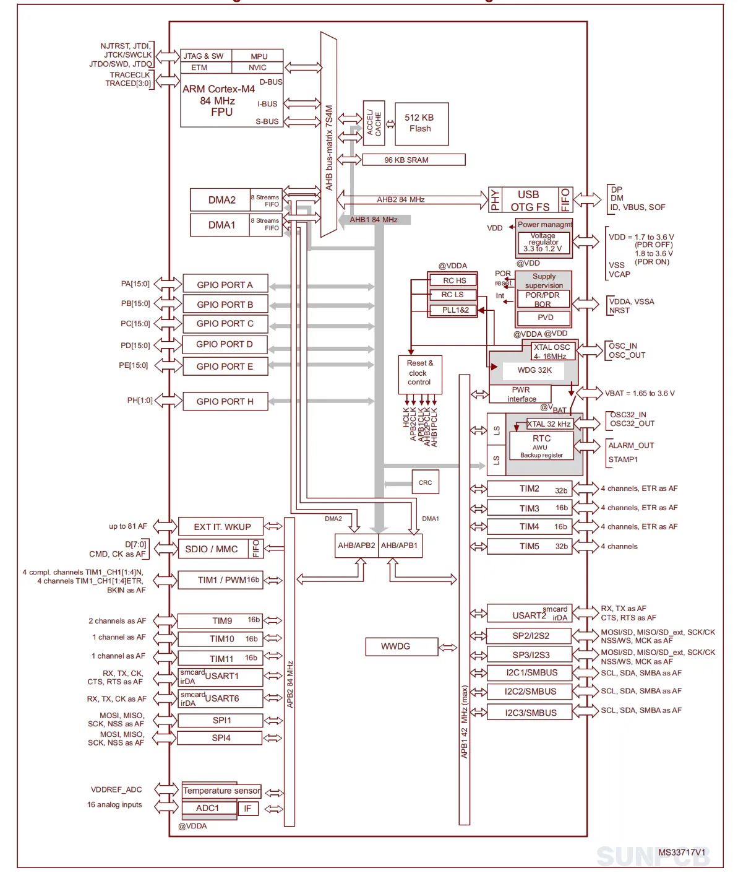
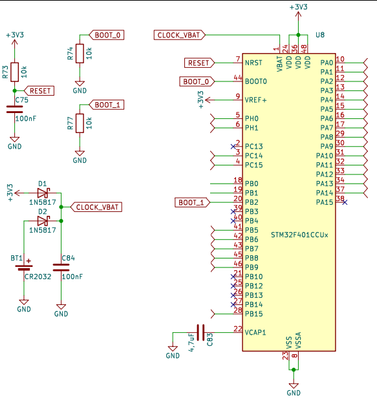
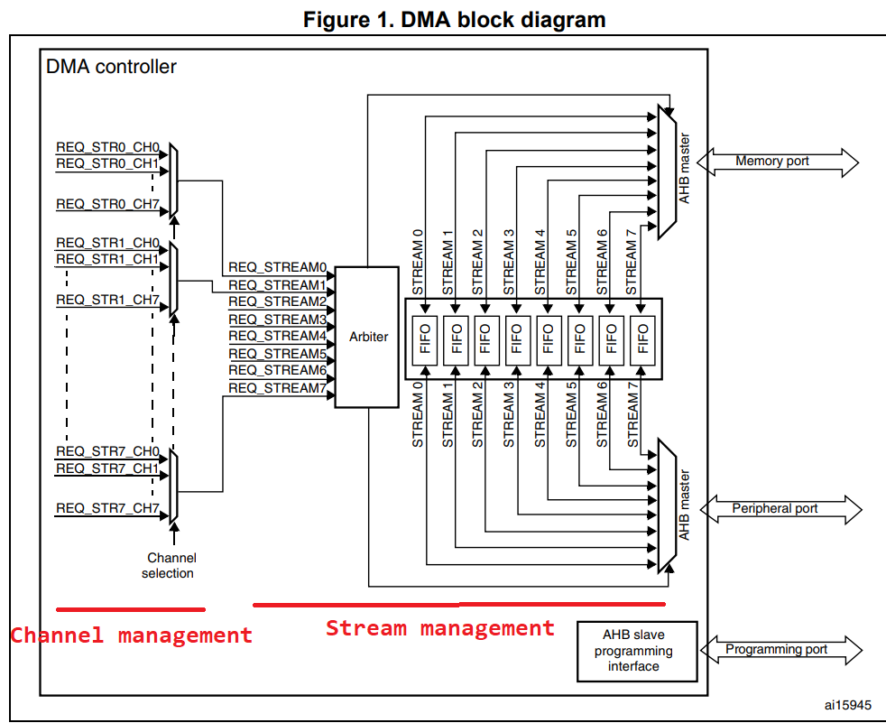
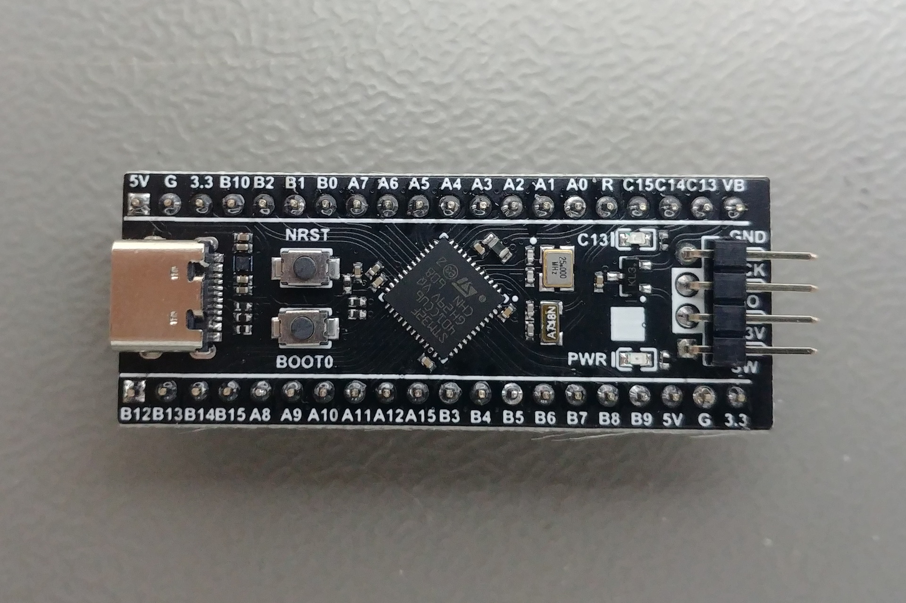
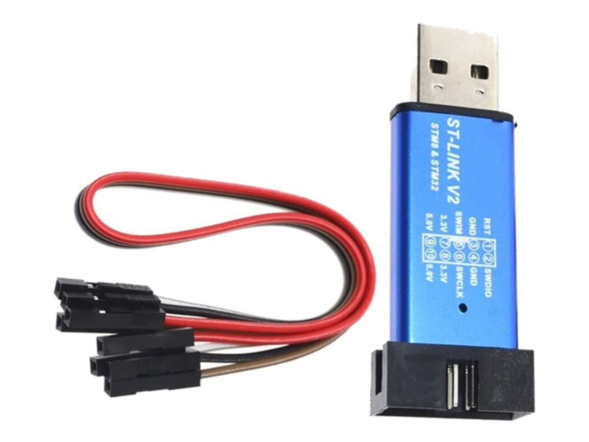
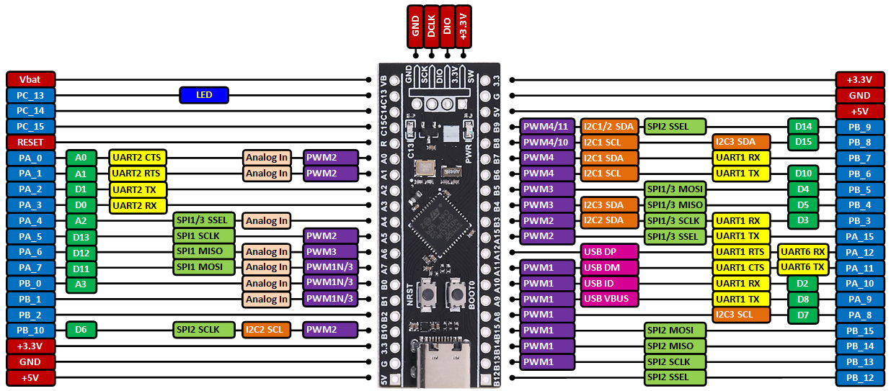

# Présentation architecturale du Microcontrôleur STM32F4

*Ir Paul S. Kabidu, M.Eng. <spaulkabidu@gmail.com>*
{: style="text-align: center;" }

---

[Accueil](../../#Accueil)
  
<br>
<br>

### **Architecture du microcontrôleur**
  
Un **microcontrôleur (MCU)** est un circuit intégré qui rassemble sur une seule puce tous les éléments nécessaires au fonctionnement d'un système autonome :

- Un **processeur (cœur)** pour exécuter les instructions
- De la mémoire (**RAM et Flash/ROM**) pour stocker le code et les données
- Des **périphériques d'entrée-sortie** pour interagir avec le monde extérieur

On parle de **système sur puce (SoC, System-on-Chip)**. Le microcontrôleur est conçu pour contrôler un système spécifique en temps réel, avec un minimum de composants externes.

**Les trois éléments importants** :

- **Mémoire Flash (ROM)** : stocke le code programme (firmware) de manière non volatile. C'est ici que résident votre application et le noyau FreeRTOS.
- **Mémoire SRAM (RAM)** : stocke les variables, la pile et les données temporaires pendant l'exécution. Elle est volatile.
- **Processeur** : lit les instructions en Flash, déplace et traite les données en RAM, et contrôle les périphériques.

Tous ces éléments communiquent via un **bus** (ici un bus 32 bits). Le fonctionnement du microcontrôleur est cadencé par une horloge (clock), comme tout système digital synchrone.

Actuellement, les microcontrôleurs les plus populaires sont basés sur l'architecture **32 bits ARM Cortex-M**, un standard de l'industrie offrant un excellent rapport performance/consommation.

---
<br>


### **Architecture du microcontrôleur STM32F401**

Le **STM32F401** est une famille de microcontrôleurs fabriqués par STMicroelectronics. Il intègre un processeur **ARM® Cortex-M4 32 bits**, une architecture moderne capable d'effectuer des calculs DSP (Digital Signal Processing) grâce à son unité à virgule flottante (**FPU, Floating Point Unit**). Celle-ci permet de traiter des nombres décimaux (type float en C) en un seul cycle d'horloge, ce qui est essentiel pour les algorithmes de contrôle (PID, Filtres, FFT), elle accélère considérablement ces algorithmes.

Le manuel de référence pour le [STM32F401 (RM0368)](https://www.st.com/resource/en/reference_manual/rm0368-stm32f401xbc-and-stm32f401xde-advanced-armbased-32bit-mcus-stmicroelectronics.pdf) détaille tous les registres.

**Caractéristiques principales** :

- **Fréquence** : généralement cadencé à 84 MHz, peut être overclocké via un multiplicateur de fréquence (PLL) jusqu'à 100 MHz. Cette puissance permet de faire tourner un noyau FreeRTOS avec plusieurs tâches concurrentes.
- **Bus** : communication avec les périphériques via une matrice de bus (Bus Matrix) AHB/APB.
- **Mémoire** : le modèle STM32F401CCU6 (celui de la carte Black Pill) dispose de :

    - 256 Ko de mémoire Flash
    - 64 Ko de RAM
 
{ align=center } 

{ align=center }

---
<br>


### **Organisation Mémoire**

Le STM32F4 utilise une architecture de type **Harvard** (bus séparés pour les instructions et les données), mais organisée sur une carte mémoire unifiée de 4 Go (adressage 32 bits). Chaque élément (Flash, RAM, périphériques) possède une adresse fixe et unique dans cet espace mémoire. Cela permet au processeur, grâce aux bus séparés, de lire une instruction en Flash tout en accédant simultanément à une donnée en RAM, améliorant ainsi les performances.

Chaque registre de configuration d'un périphérique est accessible via une adresse spécifique. 


|Mémoire/périphérique	|Taille	|Plage d'adresses| Description|
|-----------------------|-------|----------------|------------|
|Flash	|256 Ko	|0x0800 0000 – 0x0803 FFFF| Flash principale (code)|
|SRAM	|64 Ko	|0x2000 0000 – 0x2000 FFFF| SRAM (variables, pile)|
|Périphériques	|variable (Ici 512 Mo)	|0x4000 0000 – 0x5FFF FFFF| Périphériques (GPIO, timers, etc.)|
|CPU| 1 Mo| 0xE000 0000 – 0xE00F FFFF| Cortex-M4 interne (NVIC, SysTick, etc.)|

- La Flash contient le programme et d'éventuelles données constantes.
- La SRAM contient les variables, la pile et les tampons.
- Les registres des périphériques (GPIO, timers, ADC, etc.) sont accessibles dans la région des périphériques.

Le reference manual ([RM0368 pour le F401](https://www.st.com/resource/en/reference_manual/rm0368-stm32f401xbc-and-stm32f401xde-advanced-armbased-32bit-mcus-stmicroelectronics.pdf)) fournit des tableaux détaillés. En programmation bas niveau, on utilise des structures C pour représenter ces registres, comme le font les [CMSIS](https://arm-software.github.io/CMSIS_6/latest/Core/modules.html) (Cortex Microcontroller Software Interface Standard).

L'adresse de base de chaque port est donnée dans le manuel de référence. Par exemple :

- GPIOA_BASE = 0x4002 0000
- GPIOB_BASE = 0x4002 0400
- GPIOC_BASE = 0x4002 0800

Pour accéder à ces registres en C, on utilise des structures et des pointeurs, comme défini dans les fichiers CMSIS (`stm32f4xx.h`). Par exemple, `GPIOA->MODER` permet d'accéder au registre `MODER` du port A.

Exemple de structure pour GPIO :

```c
typedef struct {
    volatile uint32_t MODER;   // Offset 0x00   // Mode (0x00)
    volatile uint32_t OTYPER;  // Offset 0x04   // Output type (0x04)
    volatile uint32_t OSPEEDR; // Offset 0x08   // Output speed (0x08)
    volatile uint32_t PUPDR;   // Pull-up/down (0x0C)
    volatile uint32_t IDR;     // Input data (0x10)
    volatile uint32_t ODR;     // Output data (0x14)
    volatile uint32_t BSRR;    // Bit set/reset (0x18)
    volatile uint32_t LCKR;    // Lock (0x1C)
    volatile uint32_t AFR[2];  // Alternate function (0x20-0x24)
} GPIO_TypeDef;

#define GPIOA ((GPIO_TypeDef *) 0x40020000)
```

Quand on programme en bas niveau il est conseillé de toujours lire le [Reference Manual](https://www.st.com/resource/en/reference_manual/rm0368-stm32f401xbc-and-stm32f401xde-advanced-armbased-32bit-mcus-stmicroelectronics.pdf) (pas la datasheet) pour les détails des registres. La datasheet donne les caractéristiques électriques, le manuel de référence explique la programmation. Egalement vérifier les enable clocks avant d'accéder à un périphérique. Pour les variables partagées utiliser _volatile_ entre une ISR et le code principal.

---
<br>


### **Gestion des horloges (RCC)**

Le système d'horloge est le cœur battant du microcontrôleur. Il détermine la vitesse d'exécution et la consommation. Le STM32F4 dispose de plusieurs sources d'horloge :

- **HSI (High Speed Internal)** : oscillateur RC interne 16 MHz, moins précis mais toujours disponible.
- **HSE (High Speed External)** : oscillateur à quartz externe de 25 MHz plus précis.
- **PLL (Phase-Locked Loop)** : multiplie la fréquence d'entrée pour atteindre des fréquences élevées (jusqu'à 100 MHz sur le F401).

**Bus principaux** :

- **SYSCLK** : horloge système, alimente le CPU et la mémoire.
- **AHB (Advanced High-performance Bus)** : bus principal vers la mémoire et les périphériques rapides.
- **APB (Advanced Peripheral Bus)** : bus pour les périphériques plus lents (APB1 et APB2), avec des fréquences souvent divisées.

Un bon équilibre entre performance et consommation passe par un choix judicieux des fréquences et l'activation sélective des horloges des périphériques via le registre RCC_AHB1ENR, RCC_APB1ENR, etc. Oublier d'activer l'horloge d'un périphérique est une erreur classique : le périphérique ne répondra pas.


Registres clés du RCC :

- `RCC_CR` : contrôle des oscillateurs (HSI, HSE, PLL)
- `RCC_PLLCFGR` : configuration de la PLL
- `RCC_CFGR` : sélection des sources d'horloge et prescalers
- `RCC_AHB1ENR` : active l'horloge des périphériques AHB (GPIO, DMA, etc.)
- `RCC_APB1ENR` / `RCC_APB2ENR` : active les horloges APB (USART, I2C, TIM, etc.)

Exemple d'activation de GPIOA :

```c
RCC->AHB1ENR |= RCC_AHB1ENR_GPIOAEN;
```

Nous allons utiliser chaque fois cette fonction pour configurer l'horloge princiaple a 84MHz:

```c
void clockConfig84MHz(void){
    RCC->CR |= RCC_CR_HSEON;
    while (!(RCC->CR & RCC_CR_HSERDY));

    RCC->PLLCFGR = RCC_PLLCFGR_PLLSRC_HSE
                | (4 << 0)       // PLLM = 4
                | (168 << 6)     // PLLN = 168
                | (0 << 16)      // PLLP = 2
                | (7 << 24);     // PLLQ = 7
    RCC->CR |= RCC_CR_PLLON;
    while (!(RCC->CR & RCC_CR_PLLRDY));

    RCC->CFGR = RCC_CFGR_HPRE_DIV1
                | RCC_CFGR_PPRE1_DIV2
                | RCC_CFGR_PPRE2_DIV1
                | RCC_CFGR_SW_PLL;
    while ((RCC->CFGR & RCC_CFGR_SWS) != RCC_CFGR_SWS_PLL);
}
```

---
<br>


### **Le Gestionnaire d'Interruption NVIC (Nested Vectored Interrupt Controller)**

Le NVIC est le gestionnaire d'interruptions du Cortex-M. Il permet de :

- Activer/désactiver les sources d'interruptions.
- Définir les priorités (de 0 à 15, 0 étant la plus haute).
- Gérer la préemption : une interruption de haute priorité peut interrompre le traitement d'une interruption de basse priorité.

Chaque source d'interruption possède un numéro d'IRQ (Interrupt Request). La table des vecteurs (adresses des ISR) est située en mémoire Flash, généralement à l'adresse `0x08000000` (après reset, elle est mappée en début de mémoire). Les premiers 16 vecteurs sont réservés aux exceptions système (Reset, NMI, HardFault, etc.). Les suivants sont pour les périphériques.

Pour activer une interruption, il faut :

- Configurer le périphérique pour qu'il génère une demande d'interruption.
- Activer l'interruption dans le NVIC via le registre `ISER` (Interrupt Set Enable Register).
- Écrire le handler (ISR) avec le nom exact attendu par le startup file (ex: USART2_IRQHandler).
- Les registres NVIC sont accessibles via la structure `NVIC->` définie dans `stm32f4xx.h`.

Pour un système temps réel, la gestion des priorités est cruciale. Les interruptions associées à des tâches critiques (arrêt d'urgence, timer de contrôle) doivent avoir une priorité élevée. Les fonctions FreeRTOS comme `xSemaphoreGiveFromISR` nécessitent que la priorité de l'interruption soit inférieure ou égale à la priorité maximale configurée pour le noyau (généralement `configLIBRARY_MAX_SYSCALL_INTERRUPT_PRIORITY`).

---
<br>


### **DMA (Direct Memory Access)**

Le DMA permet de transférer des données entre périphériques et mémoire sans intervention du CPU, libérant ainsi le processeur pour d'autres tâches. C'est un outil essentiel pour :

- Acquérir des données ADC à haute fréquence (ex: 1 kHz) sans surcharger le CPU.
- Transmettre des trames UART en arrière-plan.
- Remplir un buffer audio en double buffer (ping-pong).

Le STM32F4 dispose de deux contrôleurs DMA avec plusieurs streams et canaux. Chaque stream peut être configuré avec une priorité, une direction (mémoire → périphérique, périphérique → mémoire, mémoire → mémoire), et des modes circulaires.

{ width=500, align=center }

Exemple d'utilisation avec ADC :

```c
// Configuration du DMA pour l'ADC1
DMA_Stream0->PAR = (uint32_t)&ADC1->DR;      // Périphérique
DMA_Stream0->M0AR = (uint32_t)adc_buffer;    // Mémoire
DMA_Stream0->NDTR = buffer_size;              // Taille
DMA_Stream0->CR = DMA_SxCR_CHSEL_0 | ... ;    // Configuration
```

---
<br>


### **Présentation de la carte de développement utilisée**

La carte utilisée dans ce cours est la Black Pill (STM32F401CCU6), un support de développement peu coûteux ([environ 10$](https://www.faranux.com/product/stm32f401ccu6-stm32f4-black-pill-brd44/)) et très répandue dans le monde de l'embarqué.

{ width=250, align=center }

Pour programmer et déboguer la carte, nous utiliserons un programmateur ST-LINK/V2 ([environ 6$](https://www.faranux.com/product/st-link-v2-simulator-douwnload-programmer-com41/)). Il communique avec la carte via le protocole SWD (Serial Wire Debug) et permet de flasher le firmware ainsi que de déboguer en direct depuis l'ordinateur.

{ align=center, width=250 }

**Les broches de ST-LINK/V2** : 

- Les broches SWDIO
- SWCLK
- GND
- 3.3V
- Parfois RST

{ align=center, width=800 }


**Connexions entre ST-Link et Black Pill :**

| ST-Link   | Black Pill |
|-----------|------------|
| SWDIO     | PA13       |
| SWCLK     | PA14       |
| GND       | GND        |
| 3.3V      | 3.3V       |


---
<br>


### Lien connexe

[GPIO et Interruptions](../gpio/index.md)